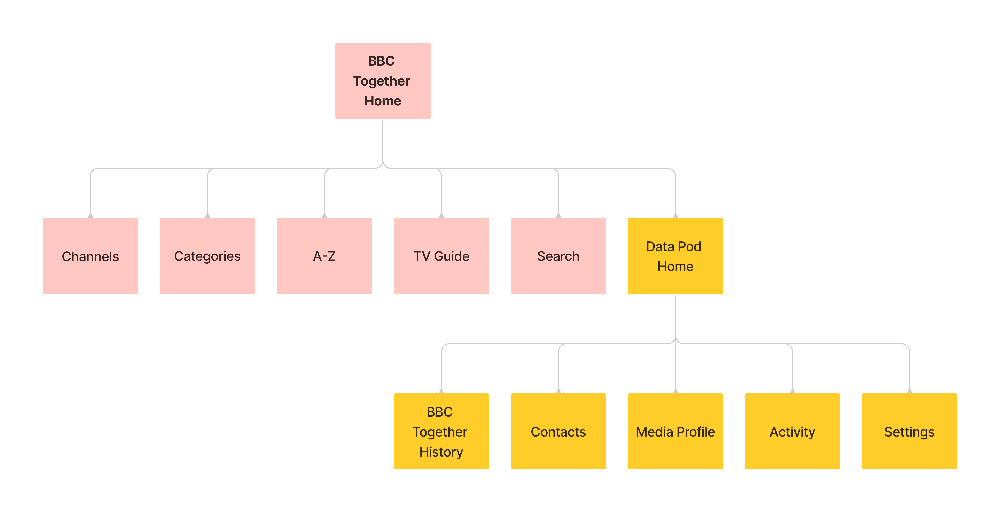

I helped design a watch party experience - including a new way for users to safeguard and manage the data they collect along the way.
 

 

## 🖼 The scene

My role

<!-- >\#UX \#UI \#VisualDesign \#UXA \#InformationDesign -->

### Overseeing craft and deliverables
I stepped into the UX Designer's role overseeing craft and deliverables during their absence (in the early stages of development).

This project was part of a wider initiative and I had been involved with previous work. 

I made improvements to the experience, while maintaining consistency across work streams. I also supported collaboration on designs in Figma.
 

 

 

Background

### The big picture
When organisations use data to deliver rich, personalised services, it's not always clear to users how their data is collected and what happens with it.
 

 

Some organisations, like the BBC, have been exploring human-centred alternatives, including [Personal Data Store technology](https://en.wikipedia.org/wiki/Personal_data_service).
 

### The technology
A Personal Data Store is decentralised to store data securely. 

>Users would have increased visibility and control of their data. They'd decide who could access it to protect their online identity.

 

The project

### Project objectives
The broader goal was to improve practices around personal data. 

To do this, we needed to understand the value to users through research and development. And demonstrate the capabilities of using Personal Data Stores through a pilot.

>How might we enhance a BBC service safely and securely with a Personal Data Store?

 

### The pilot
A watch party service called BBC Together was used for the pilot. The service was adapted to work with the current version of Personal Data Store technology (from [Inrupt](https://solidproject.org/)). 

Essentially:
- Each user would have a Personal Data Store (Data Pod)
- Watch party data would be stored securely in the user’s Data Pod
- The user could control what data was used to power their watch party experience
- BBC Together would need explicit consent from the user to access the data

 

Discovery

### Understanding work to date
My understanding of the work to date was built by listening to people in the team and reading documentation. 

>The rest of the team had collated research insights, analysed competitor watch party services, defined requirements, and designed a first pass.

To contribute effectively, I wanted to understand:

- User needs
- Technical constraints
- Stakeholder requirements
- Time limitations

 

 

The needs of the many

### Transforming industry standards
This project formed part of a wider initiative to inform large scale change.

>It was essential that the pilot fulfilled user needs. But we also needed to consider public service ambitions and business needs.

 

#### Public interest
As a public service, the intention was to influence policy and legislation to improve industry standards.

Informing policy required insight into how the concept would benefit the public as a whole. Including the feasibility for both audiences and service providers to adopt the approach long-term. 
 

 

#### Business needs
Similarly, to commit to further developments, the BBC needed insight into the value for audiences and to understand the potential for scaling up.

The pilot would act as a proof of concept to stimulate progress across portfolios.
 

 

#### User needs: personal data
Insight from users would be fundamental to developing standards in the public's interest.

>Research participants from previous work saw high-level value in the concept and technology. This pilot would allow user's to determine tangible value by exploring some of the features in more depth.

Including:
- How a Data Pod can enhance privacy
- The ability to see what data is used and for what purpose
- How the experience changes when managing data _eg.improving inferences_

Research also indicated that many user's would need insight into current data practices, in order to understand and evaluate the proposition.
 

 

#### User needs: watch parties

>The pilot was aimed at a watch party audience. 

Aggregated insight from surveys indicated the audience at the time was predominantly under 35. 

We also knew that specific types of content (like stand-alone entertainment and drama) had higher rates of shared viewing.

>The user needs around watch parties were less defined and formed a large part of initial research objectives. 

But the team had identified several user groups (and combinations thereof). Including users:

- New to BBC Together
- Returning to BBC Together 
- Hosting a watch party
- Invited to a watch party

 

 

 

One small step

### Preparing for research
I joined this project while a draft version of the pilot was being built. 

>The plan was to iterate on the designs and prepare for in-depth research.

We explored two work streams:
1. Improvements for the build
2. Aspirational features for broader research objectives

The designs would be tested with the audience through an online community and a series of moderated interviews. 

 
 

## 🏠 Challenge: A tale of two services

The problem

### Two points of friction
>A core architectural challenge was in developing an experience for two disparate services: 
>- BBC Together (a watch party service)
>- Data Pod (for managing your data)

 

The team identified two points of friction:
1. The Data Pod set-up process
2. The navigation

 

#### 1. The Data Pod set-up process
Setting up the Data Pod dominated the start and disrupted the flow. During testing, participants were deterred from using the pilot. 
 

 

#### 2. The navigation
In the navigation, access to the Data Pod was discrete and often overlooked.

A tooltip highlighted the Data Pod on entry, but:
- The tooltip was easily dismissed and forgotten
- The Pod was empty when attention was drawn to it
 

 

#### Risk
>Overall, the risks included a lack of insight regarding the Data Pod, which was critical for achieving core objectives. 

 

Finding the source of the problem

### The hierarchy
I looked at the navigation, while the Content Designer looked at the copy for the set-up process.

After analysing the designs, it was clear there was a wider issue in the general hierarchy. 

>The hierarchy was built for BBC Together, and restricted Data Pod content.

Any focus on the Data Pod would seem out of place in a hierarchy built for BBC Together.
 

 

#### The rationale
To understand the existing approach, I looked at:
- Research insights
- User needs
- Design intent

The rationale for BBC Together taking priority was to:
- Avoid deterring watch party users on entry with the Data Pod
- Focus on a single service to prevent cognitive load and context switching
- Convey ambitions for the technology as a utility service

 

#### Conveying the future
There were limitations to conveying ambitions for the technology. 

In the future, the Data Pod would be a separate product from the watch party service. 

This product would also be responsible for meeting user needs that the pilot's hierarchy was restricting, including:

- A set-up process
- Information about the technology
- A dedicated access point

>The pilot's hierarchy wasn't built for the Data Pod as a product, but the pilot still needed to meet the needs of one. 

 

Defining the challenge

### Task and success criteria
>Access to the Data Pod needed to be clearer in the navigation without deterring watch party users. 

Criteria for success included increased usage and understanding of the technology. Clearer access would also increase relevant insight to meet project objectives.

Research would allow us to gauge the response, to inform the live experience.  

 

Balancing the structure

### Information gathering
I looked at requirements for the navigation from a content and technical perspective, and analysed the architecture of similar utility services. 
 

### Mapping the structure
I mapped the content structure for the pilot's navigation to determine where a Data Pod service could belong. 
 

#### Original content structure

 

#### Balanced content structure

 

>The result was a more balanced structure to give both services room to serve their distinct functions, while sharing the same interface. 

Taking the Data Pod out of BBC Together also reduced complexity by removing a layer of navigation.
 

 

Ideating

### Conveying importance
Although BBC Together and the Data Pod had the same core requirements, they didn't necessarily have the same level of importance.

The Data Pod was the focus of research objectives, but remained a utility service. And needed to remain unobtrusive to the watch party experience. 

>The level of importance would be conveyed with the visual style and mechanics. 

Considerations included:
- The location for accessing the Data Pod
- The brand (including colour and size)
- The mechanics of navigating between the two services

 

 

### Information gathering
I looked at how users currently moved between services and accounts by identifying patterns in streaming services, social media, and operating systems. 

I also received regular feedback from the team.
 

### Ideas
There were several options to consider for the interaction. Including:
- Simply increasing the size of the link
- A service selection screen 
- A top-level banner or floating element

I also looked at previous designs including a side drawer. 

 

Proposing a solution

### A new top-level navigation
>To improve access to the Data Pod, I proposed we introduce a second logo to create a new top-level navigation for the pilot. 

 

#### Original navigation

 

#### Proposed navigation

 

#### Rationale
A logo for the Data Pod (located next to the BBC Together logo) would:
- Establish the Data Pod's role as a separate service in the visual hierarchy 
- Provide clear access to the Data Pod (potentially increasing relevant insight) 
- Allow users to switch between services with ease
- Retain optional access to the Data Pod to remain unobtrusive  
 

#### Outstanding questions
The main concern at this point was in breaking a familiar interaction pattern. 

- Did users ever make use of the logo to navigate to the home page? 
- For those that didn't, could we convey the ability to navigate clearly enough? 
- As the Data Pod was a utility service, should it be lower in the visual hierarchy? _Eg. By reducing the size of the logo_.

>Overall, the proposed solution was well received and we decided the concept was developed enough for testing. Insights from this would help to improve the designs going forward.

 

Changing the name

### Setting expectations
I noticed the name of the pilot, _'BBC Together'_, didn't align with the new balanced navigation and copy.

Several names had been explored in the past. The team learned that:
- The Data Pod relied on a descriptive name to optimise understanding
- The name BBC Together was familiar with existing audiences
- The two services required distinct names to maintain separation

>I proposed changing the name of the pilot to BBC Together + Data Pod. 

 

#### Original name

 

#### Changed name

 

_'Together+'_ was a front-runner, where the '+' would signify an enhanced version of BBC Together. Adding _'Data Pod'_ to the name reflected the new balanced copy and navigation. 

>The intent was to help set expectations for the pilot and communicate potential value. 

We decided to test the new name in upcoming research.

 

Testing the changes

### Success criteria
Success criteria for the name, navigation and copy during the set-up process included:
- Increased awareness of the Data Pod
- Undeterred by the Data Pod
- Increased usage of the Data Pod
- Navigating between BBC Together and the Data Pod without issue

 

### Research outcomes
>Overall, research outcomes indicated the new copy, name and navigation improved awareness and understanding. But there were opportunities for improvement. 

In the navigation, the ability to interact with the logo was unclear. And although there was some improvement, the Data Pod set-up process still caused some friction.
 

### Next steps
We re-designed the set-up process with a content-led approach. And for the navigation, I continued to develop the interaction states. 

 

Improving the navigation
 

### Clarifying the ability to navigate
To improve the navigation, I explored several interaction patterns and states including a switch, buttons, and tabs. 
 

#### Switch

 

#### Underline

 

#### Buttons

 

#### Tabs

 

All the options I presented to the team were seen as an improvement, but the tabs were considered the clearest. 

>No issues were revealed in subsequent research and the tabs were used in the final pilot.

 

#### Tabs on the home screen

 

 

Improving the set-up process
 

### Defining the structure
The team analysed user research insights and stakeholder feedback to determine the structure and content for the set-up process.

At this point my focus was split between projects, but I assisted with the UI and Visual Design when possible. 

>For the visual design, I considered two potential approaches:
>1. Giving both services equal weight
>2. Leading with BBC Together, with some weight to the Data Pod

I collated sketches and mock-up’s as a starting point.
 

#### 1. Equal weight

 

#### 2. BBC Together led

 

The content and structure aligned with the second approach. 
 

### Outcome
I created BBC Together branded screens with Data Pod branding where appropriate. 

>The changes reduced complexity and prevented the Data Pod from overwhelming the set-up process. 

 

#### Before (Data Pod focused)

 

#### After (BBC Together focused)

 

In the initial designs, information about the Data Pod overwhelmed the introduction. However, following changes there was a lack of information. 

The plan was to create a discrete explainer module to inform users about the Data Pod. 
 

### The final set-up experience

>Following several iterations and rapid testing, the pilot went live with a much shorter and balanced set-up process.

 

 

There were two entry points aimed at different mindsets: 

1. Watch party focused
2. Special interest in the Data Pod

 

#### 1. Watch party focused
The direct entry point to the pilot prioritised BBC Together and a watch party audience. But there was an optional explainer for anyone curious about the Data Pod.
 

 

#### 2. Special interest in the Data Pod
There was a second entry point through BBC Taster - a platform for experiments. The Taster audience was more likely to have an interest in the technology. Information about the Data Pod was more prominent on this screen.
 

 

Outcome
 

### A step in the right direction
Rapid testing indicated the solutions for the set-up process and navigation were significant improvements.

>The changes alleviated frustration and understanding of the Data Pod improved.

Communicating the value of a Data Pod succinctly continues to be a challenge, particularly in the context of a service. But the Data Pod explainer tested well with participants, indicating a step in the right direction. 

Thankfully, many of the structural challenges were unique to this pilot and the early stages of development. The need to balance two services in a single pilot is unlikely to reoccur as the concept scales up.

 
 

## ✉️ Challenge: Making contact

The problem

### Technical holes
During a watch party, the user was either a host or invitee.

>I was tasked with two problems:
>
>1. On the invitation screen, the invitee had the option to send or receive contact requests, which wasn't technically possible.
>2. The invitation screen was also identical to the waiting area, when they should be visually distinct.

 

 

Analysing the problem

### Misaligned journey's
By talking to the team, and stepping through the host and invitee journey's, I could better understand the problem. 

>The invitation for the invitee was conflated with the idea of a waiting area.

The invitation looked like a waiting area, but couldn't have the functionality of one (because they hadn't joined the party at that point).

>As the invitee would bypass the waiting area, the journey's were misaligned and as a result, noone could save each other as contacts. 

In addition, the host and invitee would 'join' the watch party on different screens. So they would have different views of what was intended to be a shared view. 

There was potential for much confusion.
 

#### Host and invitee journey's

 

Defining the challenge

### The task
>We needed to align the host and invitee experiences, to allow contact saving and prevent confusion. 

A shared view on entry was necessary.

My initial reaction was that the invitee needed a waiting room to align with the host's journey. 

However, after searching for user needs, I couldn't find any for the waiting area.

>After discussing it with the team, I chose to explore two options:
>1. A waiting room for both host and invitee
>2. No waiting room for either host or invitee
>
>For both approaches, the invitee also required a distinct invitation screen.

 

Making the invitation distinct

### A moment of joy
I used an empathy map to understand the type of content an invitee might require on a watch party invitation. 

>Receiving an invitation to a party is usually a smiling moment. I styled the screen with this mind.

After discussions with the team around feasibility, I sketched ideas for the visual design. 

I considered using a simple, quick animation to highlight the moment without disruption. Ideas included:
- Confetti
- A card or envelope unfolding
- A slight shine to the border or background

With time limitations and accessibility considerations, I settled on a simple ticket shape instead.
 

 

### Outcome
>The invitation screen was well received and frequently pointed out by team members and research participants as a positive part of the experience. 

As the pilot developed, the screen was simplified and adapted to align with the rest of the experience.  

#### Final invitation design

 

Adding a waiting area

### Interruptions
While adding a waiting area to the invitee journey, I ran into potential friction.

>The host had control of playback. So when the host started the show and the invitee was in the waiting area, there were two options: 
>
>1. The invitee could be automatically taken to the streaming area
>2. The invitee could choose to leave the waiting area

Neither approach seemed ideal. With the first option, the invitee could be taken away in the middle of saving contacts. With the second, they could miss the start of the show.

I looked at potential solutions, including:
- A persistent modal
- Adapting the media player

 

#### A persistent modal
>If the invitee was automatically taken from the waiting area to the stream, a persistent modal could allow the invitee to finish saving contacts.

 

However, limiting contact saving to the waiting area (and persistent modal), created time restrictions. 

To make contact saving more flexible, I looked at adapting the media player.
 

#### Adapting the media player
>By adding contact saving functionality to the media player, users could save each other as a contact any time during the watch party.

An existing panel in the streaming area had a list of the watch party participants. The contact saving functionality fit well in this context, was unobtrusive, and allowed for more flexibility.
 

 

#### A shared experience
After adding a waiting area to the invitee journey, the host and invitee experiences were more aligned.

 

Removing the waiting area

### Straight to the party

>To remove the waiting area, I moved all the functionality from the waiting area to the media player's side panel. 

In addition to contact saving, this included:
- The host's ability to invite people
- The host's ability to change the watch party name
- Everyone's ability to change their display name

>Without a waiting area, users would go directly to the streaming area.

They could then invite people and change their preferences anytime during the watch party, without having to leave. 
 

 

#### Inviting people
When moving features from the waiting area to the streaming area, the interaction remained largely unchanged. 

>To invite people to the watch party, the host could launch a modal using an 'invite' button available only to them.

I added programme information and altered the styling of the modal for consistency.
 

 

#### A shared experience
After removing the waiting area from the original designs, we had a second option for aligning the host and invitee journeys.
 

 

Testing the changes

### Research outcomes

After presenting the options I had explored to the team, we decided to test the experience without a waiting area in research.
 

>During moderated research, there were no red flags from removing the waiting area. And with some adjustments, the approach was used in the final pilot.

 
 

## 🎨 Challenge: Battle of the brands

The problem

### Brand identities

>There were two problems:
>1. Multiple identities 
>2. No Data Pod identity

 

#### 1. Multiple identities
The pilot was focused on two services - BBC Together and the Data Pod. But there were other brands to consider:

- The BBC had a global brand identity. It applied to features like signing in, which worked across all products and services. 

- The pilot would be available on a product called BBC Taster, which had it's own identity.

- On top of this, BBC Together was often mistaken for BBC iPlayer (the flagship streaming service) during research.

>Juggling multiple identities was an existing challenge across the BBC. And the addition of the Data Pod compounded this problem.

 

#### 2. No Data Pod identity
In the original designs, the Data Pod didn't have a brand identity. The global BBC brand was used to fill the gaps.

>Without a clear ability to identify the Data Pod, it couldn't be evaluated effectively by users. 

 

### The task
>To aid recognition and prevent confusion, we needed to:
>1. Shape the brand identity for the Data Pod
>2. Apply the brands consistently

 

 

Shaping the Data Pod identity

### Illustrations
To develop a brand identity for the Data Pod, we leveraged a toolkit of illustrations. The toolkit was commissioned specifically for communicating the future of data stewardship. 
 

 

>I took elements from the progressing Data Pod designs, and used the toolkit to develop the brand identity.

 

### The logo
As the team developed the Data Pod screens, I combined the logo they used, with the illustration style. 

>The toolkit used dashed lines to convey streams of data. After exploring different compositions, I settled on a dashed underline. 

 

 

The purpose of the underline was to introduce colour and serve as a hover state for navigation.

 

### The colour palette

The background colours for the Data Pod were established, but the palette was missing a highlight colour to aid recognition.

I considered blue tones for the Data Pod, to differentiate it from BBC Together and the BBC's core products.

After concerns were raised around the [stereotypical use of the colour blue with new technology](https://www.bbc.co.uk/rd/blog/2021-08-explaining-artificial-intelligence-part-3-what-does-ai-look-like), I switched to the warmer palette used in the illustrations.
 

 

>I suggested using the yellow as a highlight colour for consistency across the Data Pod UI. The shade provided enough colour contrast for text.

 

### A Data Pod explainer
While working on a Data Pod explainer module with the Content Designer, I continued to develop the identity. 

>We prioritised cognitive ease and readability for the subject matter. 

I used:
- The serif version of the BBC Reith font (to match the informative tone)
- A light background suitable for reading

The illustrations, bullet points, spacing and layout helped to make the information more approachable. 
 

 

Applying brand identities

### Consistent branding
The original designs used elements of the global BBC brand, which was appropriate for certain parts of the experience, such as signing in. For other parts, it was potentially confusing. 

>I removed the global BBC brand where relevant and worked with the team to apply the appropriate branding throughout.

There were some screens where the appropriate brand identity was unclear. Including when allowing BBC Together access to the Data Pod. The screen went through several iterations.

After I applied the Data Pod brand, the team could focus on developing the content.
 

 

### Data Pod view
As the Data Pod identity developed, I worked with the team to align the Data Pod view in the pilot. We also simplified the content and layout.

>I worked with the Producer designing the Data Pod screens to:
>
>- Optimise layouts for development 
>- Create a consistent menu element
>- Apply the yellow highlight colour

 

#### Contacts data
During the pilot, user's could save each other as contacts, and the Data Pod area provided a list of them.

After working with the Producer to optimise the UI and visual design, we used _'Version 1'_ in research.

I then simplified the screen for the build in _'Version 2'_. At this point, the brand identity had developed further. 
 

 

By saving someone as a contact, user's were essentially creating a connection between their Pod's. 

>I used the pill shape, which I introduced in previous screens, to represent a Pod. This time, I explored a more discrete style with potential interaction. 

I also introduced a way to filter groups of contacts and a search bar to find specific people.
 

### BBC Together
In addition to developing the brand identity for the Data Pod, I made some changes to how the BBC Together brand was applied.
 

#### Backgrounds
>I adapted the backgrounds in BBC Together to make them more consistent and use more of the space available. 

I also made more use of the thin strokes, so focus remained on the content. 
 

 

#### Introduction screen
The global brand was used in the original set-up process. After the content was developed, I introduced the BBC Together identity.

>The screen was simple and brief, so user's could move on with the experience.

I used the thin border and introduced iconography from the core experience, but with the intention of keeping focus on the content.
 

 

 

Creating a single promo

### Blending brands
Although we needed to maintain separation of BBC Together and the Data Pod, the need for a single promotional image for the pilot was unavoidable. 

>The promo needed to convey both the watch party and Data Pod aspects. Earlier attempts had swayed in one direction. 

 

 

>I continued to develop the image and introduce more of the BBC Together brand into the last attempt. 

I created four options and we conducted guerilla testing to refine them.
 

 

 Most participants found the fourth option more representative of the pilot and it was used for the live experience.
 

 

 

Outcome

### The Data Pod
After developing an identity for the Data Pod, it became more identifiable for evaluation.
 

### BBC Together
During early research, some participants considered the branding slightly dated. But we began to receive positive comments following changes to the brand and visual design.   

 
 

## ⚙️ Iterating

Research

### Assembling prototypes
>The team worked on different parts of the experience in parallel and we met regularly for updates, collaboration, and feedback.

As the work came together, I oversaw the integration into research prototypes. I maintained consistency across the UI and visual design, and inserted the appropriate transitions and animations. 
 

### Delivering stimulus
I attended research planning sessions to provide feedback and understand the requirements for the stimulus.

The interactive prototypes were used in moderated research sessions. I supplied the link to the prototypes and was on hand to make notes and make any necessary adjustments.

We also used static images for feedback from an online community. And in-between research, we would conduct rapid testing.
 

### Analysing feedback
The team came together to analyse the feedback in Miro and determine next steps. The research insights would help to form tasks for subsequent sprints.
 

 

Updating the build

### Technical build
>As confidence in the designs increased following research, I integrated the relevant elements into a separate prototype for building. 

We collaborated with the relevant Engineers responsible to ensure designs could be replicated.
 

#### Sign-off
>It was challenging to determine when designs were ready for building. 

We began developing a process for signing designs off, including:

- Detailing the requirements for sign-off in tickets
- A traffic light system to communicate level of confidence in the designs
 

#### Multiple workstreams
We had a single file for several workstreams, (including research stimulus), which caused some confusion for Engineers. 

I spent some time labelling and annotating designs and prototypes, which prevented some confusion. 

The general practice now is to create a separate file for the technical build.
 

### Launch
Unfortunately I wasn't involved in the project for the final iterations and delivery. But I was able to take part in some testing to resolve technical bugs before the pilot went live. 

Some designs didn't make the final experience, but priorities were met and the pilot went live for over 6 months.

 

## 🎀 Wrapping up

Result

### The live trial
>The results of the trial are in the process of being analysed to determine next steps. 

Personally, I found it extremely rewarding to work on a project that was tackling large scale issues and exploring new ground. 

In companies the size of the BBC, change is a long-term process. The technical achievement alone is worth celebrating. But it's also gratifying to hear news of this project and the wider initiative make its way across the organisation and beyond. 

>The project has helped platform the conversation and pave the way for more ethical data practices.

An overview of the pilot and technology can be found in the following BBC News segment.
<iframe class="youtube-video" src="https://www.youtube.com/embed/rhHsNFzvaUU?si=9ORRkmbS73Y6sThJ&amp;start=160" title="YouTube video player" frameborder="0" allow="accelerometer; autoplay; clipboard-write; encrypted-media; gyroscope; picture-in-picture; web-share" allowfullscreen></iframe>

 

Further reading

[BBC R&D blog](https://www.bbc.co.uk/rd/blog/2022-10-social-tv-and-personal-data)

[Inrupt case study](https://www.inrupt.com/case-studies/the-bbc-shows-its-audience-the-future-of-personal-data-access-and-consent?utm_source=linkedin&utm_medium=organic_social&utm_content=cabfa9dc-eac7-4393-a386-329efc252d59)

