Easily navigate between key moments in a live stream.   And get match statistics without leaving the player. 
 

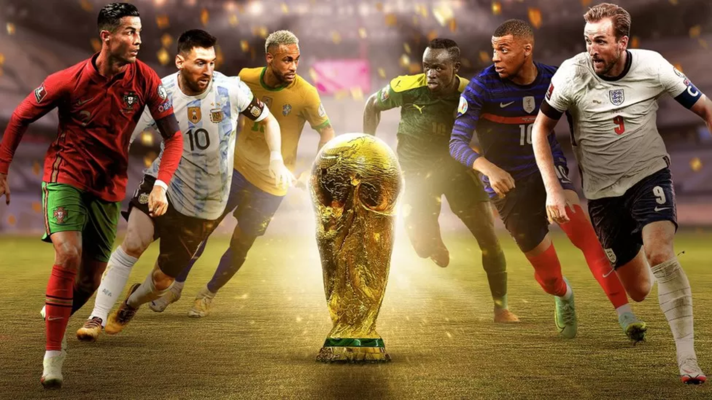

 

## 🏟 Field of play

My role

### Steering the UX
As a UX Designer at the BBC, I steered the UX with support from the Principal.  

>My role involed:
>
>- Collating requirements
>- Producing designs and prototypes
>- Gathering feedback in 1:1 sessions and a survey
>- Refining the experience using feedback
>- Providing front-end support
>- Optimising accessibility 

 

 

The team

### Core line-up
- Project Manager
- Head of Flexible Media
- Head of Architecture
- 4 - 7 Engineers
- UX Principal
- UX Designer

 

### One BBC
>A small multi-disciplinary team worked on the core experience, and collaborated regularly with colleagues across the BBC. A larger working group came together on a weekly basis for updates and feedback. 

 

 

The project

### Project goal
>The goal was to enhance live streams of the World Cup - and provide the user with a more flexible experience on BBC Sport.

Enhancements included:

- The ability to skim and navigate between key moments in a match
- The availability of extra information, like match statistics and player line-ups

 

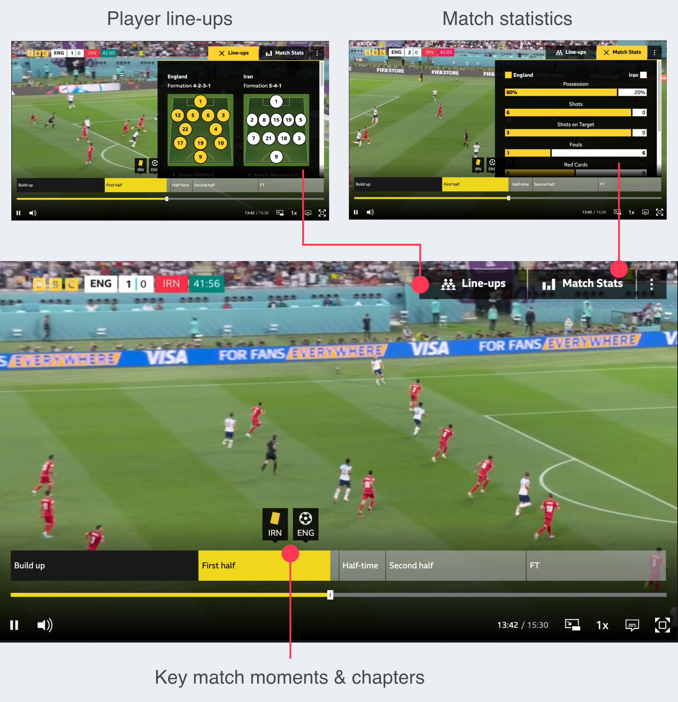

 

 
 

## 📚 Background

Why

### User needs & wants
Previous research and experimentation had revealed potential value for audiences. 

>As well as:
>- A general expectation for experiences to flex and adapt to different contexts. 
>- A clear desire for in-depth match statistics, especially for larger matches that we see in the World Cup.

 

### Product goals
Product objectives included an OKR to increase experimentation and advance innovation across the product space. 

The technology for this project was in the research and development phase, and identified as an enabler for achieving long term growth. By scaling up experimentation for this project, we would contribute towards the OKR and stimulate further progress across portfolios.

 

 

When

### The clock
We had 2 Months before the first World Cup match. 

For the designs, we had 2 weeks.

>I used the first week to:
>- Understand the landscape
>- Explore potential solutions and determine feasibility
>- Shape the first iteration

>And used the second week to:
>- Test the first iteration
>- Gather feedback internally and from users
>- Refine the designs

 

 
 

## ⚽️ Week one

 Information gathering

### Discovery & understanding
To understand what users were familiar with, and how to approach the designs, I looked at:
- Existing research
- Previous designs
- Competitor services
- Brand guidelines
- UI templates

I collated all relevant information in a Figma file, which I shared with the working group. 

The file outlined the design process and was updated regularly. 

>All the work in progress was available for anyone to view, collaborate, and feedback on.

 

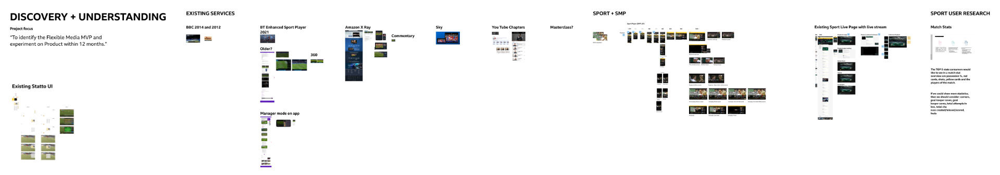

 

 

 Discussing feasibility

### Sketches & mock-ups
I sketched ideas and created mock-ups to aid discussions around feasibility and help define the first iteration of the designs. 

>Ideas included, a draggable stats panel and adaptations to the media player UI - which we realised would not be possible in the time available. 

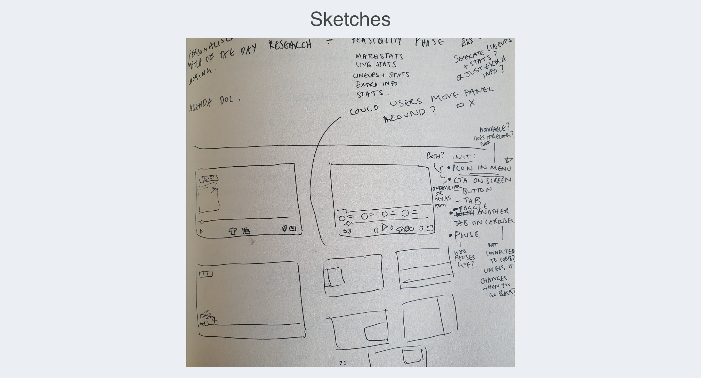

 

### Small screens
Due to time limitations, there was a desire to focus on larger screen sizes.

However, a desktop-only experience was outdated and to serve users a truly flexible experience, small screens needed to be considered. 

I offered to explore options for the mobile experience.

>With ease-of-use and accessibility in mind, my suggestions included a carousel and a list of key moments. 

 

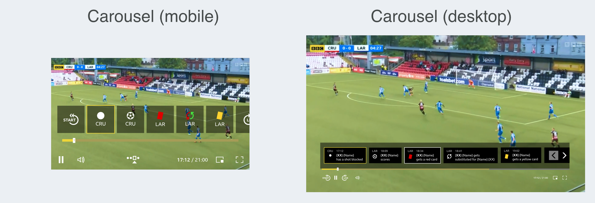

 

We discovered that a carousel or list wouldn't be possible. But we did find that a mobile experience was more achievable than we initially thought. Particularly as data showed significant mobile usage.

 

First iteration

### Visual Designs & prototypes
>For the first iteration of the designs, I: 
>- Applied accessibility guidance (eg. for sizing and colours)
>- Applied the BBC Sport style guide
>- Aligned with the media player's UI
>- Created prototypes to demonstrate the experience
>- Presented to the working group for feedback

 

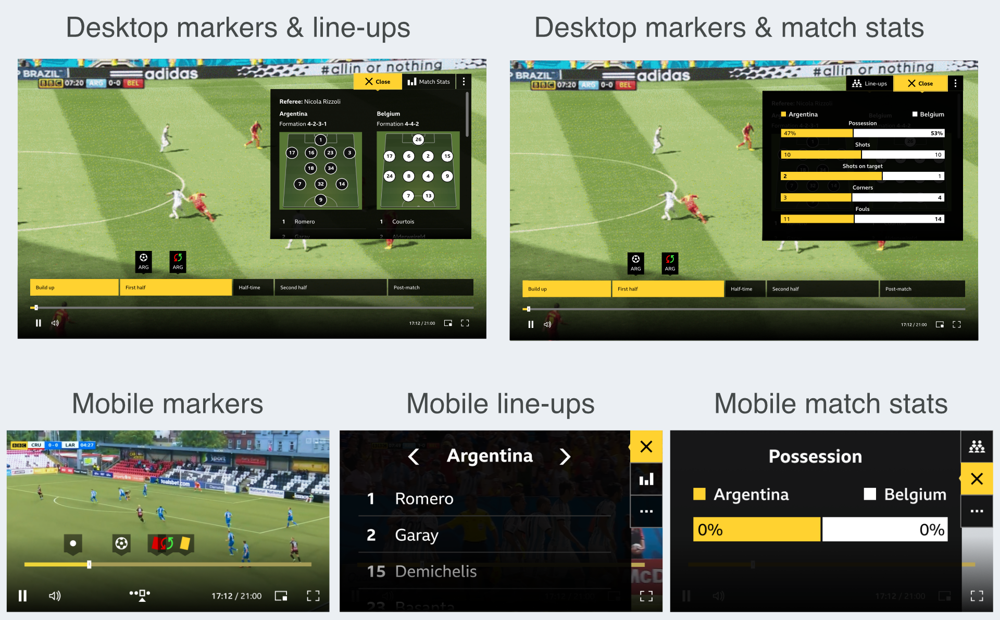

 

### Screen reader experience
In addition to the visual prototypes, I documented the screen reader experience and requested a dedicated session to focus on the unique requirements.
 

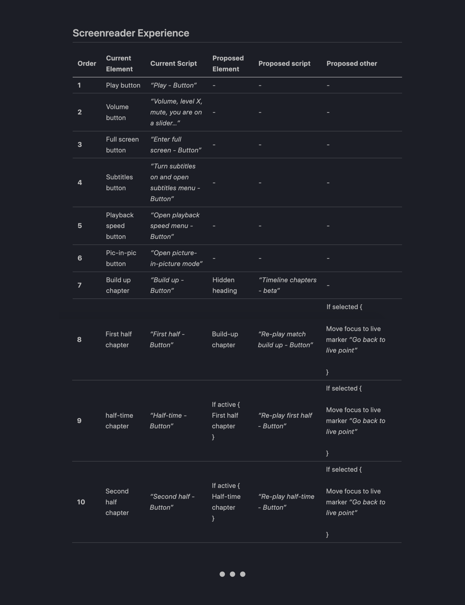

 

 

Other considerations

### User journey
>While creating the user journey, I identified some additional design considerations: 
>1. Ways to obtain feedback from users
>2. States where there's no data to show
>3. Potential error messages

 

#### 1. Feedback options
Initially, we thought to gather feedback through a survey. After realising it wasn't feasible to analyse a large number of text responses, we went with a star rating.
 

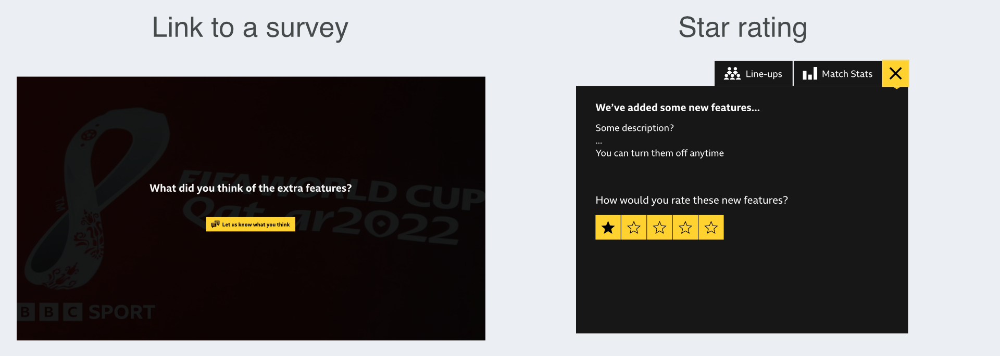

 

#### 2. No data to show
During the build up to the match, there would be no data to show beyond line-ups. I mocked up the default behaviour used on BBC Sport at the time. 
 

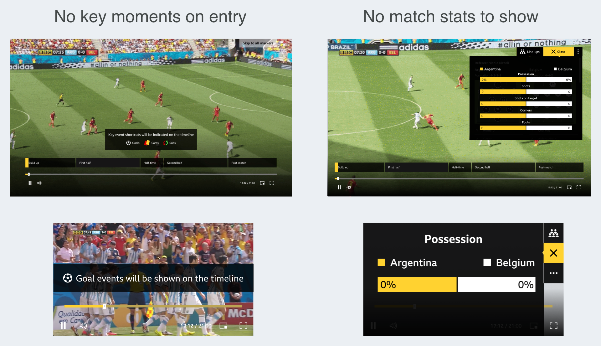

 

#### 3. Error message
For potential errors, I mocked up a message with placeholder text. (Later, it was decided to remove the plugin entirely in these cases).
 

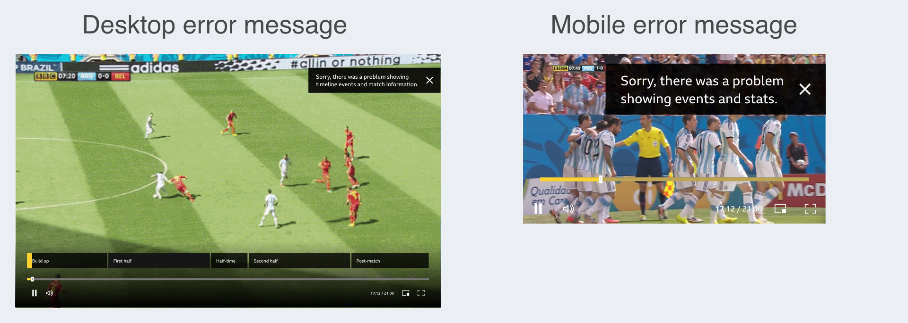

 

 
 

## 📣 Week two

 

Testing the first iteration

### 1:1 sessions
To gather feedback from football fans, I set up four 1:1 sessions. 

I asked participants to imagine they were about to stream a football match on BBC Sport. And prompted them for their thoughts as they went through the prototypes. 

>The feedback helped to refine the interaction and gave us more confidence in the iconography, text changes, and designs for smaller screens (where the experience was limited).

 

Content Research

### Survey 
I created a survey (Google form) to ask respondents about their viewing habits, preferred key moments, and preferred match stats. 

I consulted with the UX Principal and Senior User Researcher to refine the wording and formatting. We used a card sort to understand preferences and received 36 responses. 

>Together with previous research, the data gave us enough confidence to prioritise certain key moments and match stats. Particularly on mobile, where space was limited.

 

Delivery

### Assets
The Engineers had begun work on the front-end earlier than anticipated. I refined iconography for the key moment markers in parallel. And liaised with the Project Manager and Engineers to deliver the necessary assets.
 

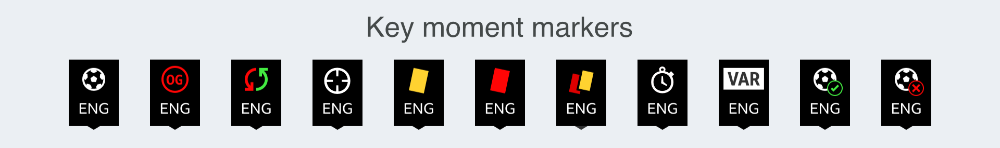

 

 
 

## 🎟 Implementation

Front-end support

### Javascript & CSS
>As the Engineering team were low on resource, I offered to help with the front-end development.

The existing information panels relied somewhat on third-party code. My first task was to refactor the panels so they used vanilla Javascript and CSS. 

I then worked on refining the different breakpoints. Tasks included:

- Implementing the star rating functionality
- Adjusting the text hierarchy in line with design guidelines
- Adding some player stats to the line-ups panel
- Ensuring the tab states were available to screen readers
- Adding alt text for screen readers

 

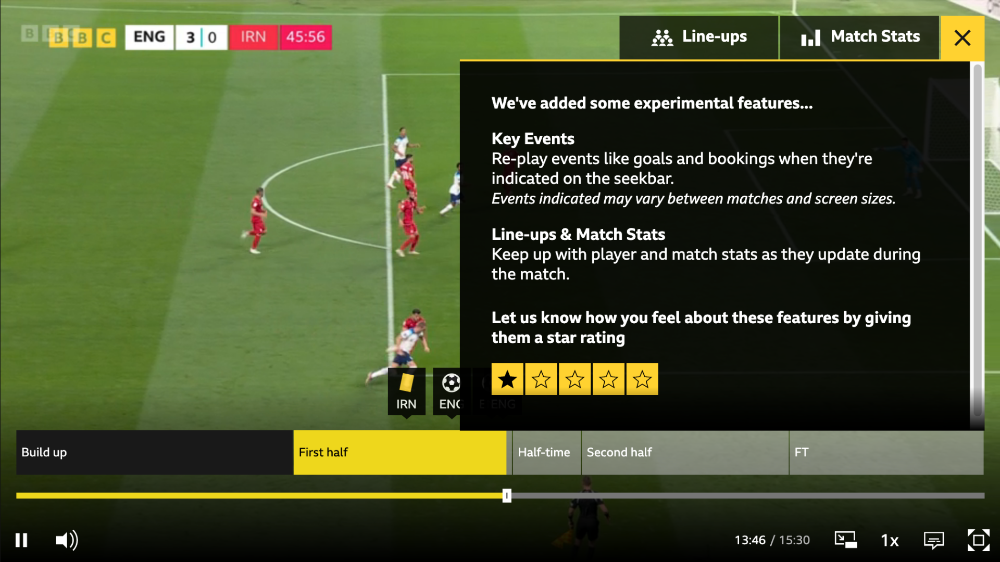

 

 

QA

### Testing a live experience
As live events were required for accurate testing, we conducted tests during the Women's Super League and FA Cup (before the start of the World Cup).

>I contacted the Assistive Technology team to help with improving accessibility. They provided a summary of their findings, which we used to make the experience more accessible. 

We all tested the experience across multiple devices and provided screenshots of our findings. 

The results helped to define tasks and next steps for implementation.

 

 
 

## 🏆 Result

Launch

### The live experience
The experimental features went live to the entire BBC Sport audience. Engineers in BBC Sport were on hand to monitor all products and tools during the live World Cup matches.
 

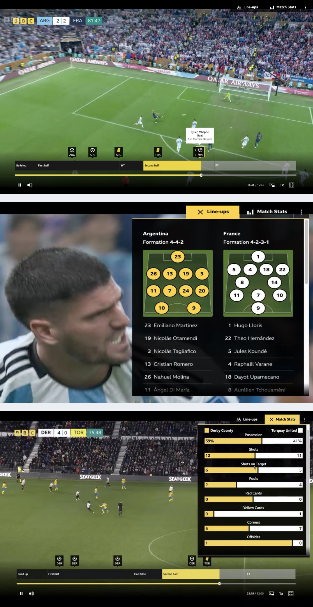

 

 

Performance

### Quantitative
The features had over 950,000 unique users (an average of 47,000 users per game), and 30% returned to use the features again. 

>Over 16,000 users rated the experience, with an average of 4.1 stars (out of 5).

 

### Qualitative
To understand preferences on a deeper level, Researchers in R&D used a [Human Values framework](https://humanvalues.io) to collate qualitative insights.

They interviewed a diverse group of 12 participants 4 times over the course of the World Cup.

>Overall, participants appreciated the ability to consume match content while honouring other commitments. 

In addition to reducing screen time, while consuming match content, researchers found there was a positive impact in:

- Connecting with others
- Pursuing pleasure
- Having autonomy

Participants also provided us with valuable feedback on the interaction, UI, and data visualisations, to develop the features further.
 

 

Outcome

### Value for all

The BBC has been on a mission to create a positive impact with digital experiences - this project demonstrated the ability for these features to do just that.

>The response from this project was overwhelmingly positive - from both audiences and BBC staff. 

There have been several spin-off projects following this success, including experiences for Winter Watch bird feeder cameras, and Eurovision. 

The work has been transitioning fully from R&D to the product space, and there are plans to develop the features for use across the BBC estate, including iPlayer.

 

### Personal development

>Personally, I found working on this project a joy. I'm proud to have been part of a team, that made such a big impact at the BBC. 

I was able to steer the UX, aswell as improve my coding skills. It was also a great opportunity to learn more about the strategic elements that bring projects like this to life. 
 

 