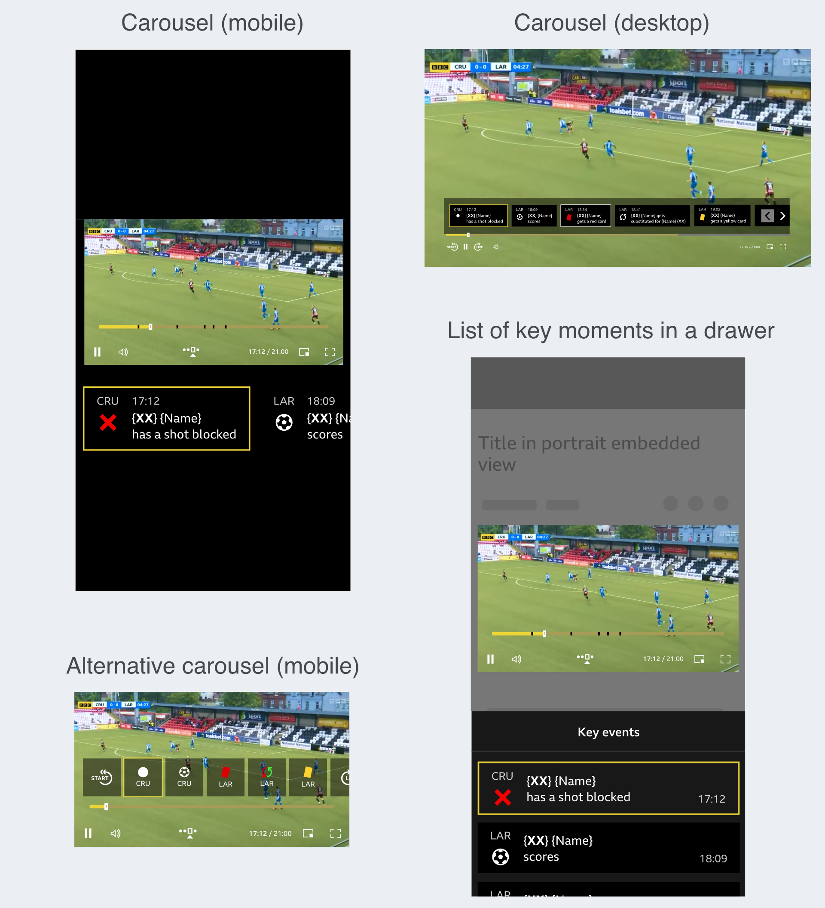

Navigable highlights, match statistics, and line-ups, while streaming live World Cup matches. 
 

 

## 🏟 Field of play

My role

### Steering the UX
>As a UX Designer at the BBC, I steered the UX with support from the Principal.  

My role involed:

- Determining requirements
- Producing designs and prototypes
- Testing designs in 1:1 sessions
- Creating a survey to refine the experience
- Providing front-end support
- Optimising accessibility 

 

 

The team

### Core line-up
- Head of Flexible Media
- Project Manager
- Head of Architecture
- 4 - 7 Engineers
- UX Principal
- UX Designer

 

### One BBC
>We worked on the core experience in a small multi-disciplinary team, and collaborated regularly with colleagues across the BBC. 

For the UX, we consulted with BBC Sport, Media Services, and the Assistive Technology team. 

The larger working group came together on a weekly basis for updates and feedback. 

 

 

The project

### Flexible media
>Flexible media is content that supports non-linear, personalised consumption. 

Outcomes from the work to date suggested audiences valued flexible experiences.
 

### Project goal
The goal for this project was to enhance coverage of the World Cup - to provide the user with a more flexible live experience on BBC Sport.
 

>Enhancements included:
>
>- The ability to view and navigate between key match moments
>- View match statistics from any point in the match
>- View player line-ups

 

 
 

## 🥅 Discovery & understanding

Needs

### User needs
>I met with the Senior UX Designer in BBC Sport to learn more about audience needs and work in progress. 

Research outcomes revealed a need for more in-depth match statistics. Specifically for important matches like the World Cup, and when attention was divided. Participants also expressed their preferred level of complexity.

In addition, the Designers had:

- Made developments in the way scores and fixtures were communicated
- Explored a dark mode, which suited immersive environments like the media player
- Refined icons for familiarity
- Explored a 'timeline' feature

 

### Business requirements
Flexible media was one of 5 R&D workstreams identified as an enabler for achieving long term growth. 

The workstreams were identified as part of an OKR to increase experimentation and advance innovation across the product space.

By scaling up experimentation, this project would contribute towards the OKR and stimulate further progress across portfolios.

 

 

Constraints

### The clock
Overall, we had 2 Months before the first World Cup match. 

>For the designs, we had 2 weeks to:
>
>- Understand the landscape
>- Explore potential solutions to determine feasibility
>- Define the experience
>- Gather feedback for refinements

I decided to use the first week for exploration and to determine feasibility. And the second week for refining the experience.

 

### Mobile-last
>Due to time limitations, there was a desire to focus on larger screen sizes.

There were concerns that aiming for the World Cup was overly ambitious. To find a workable solution for smaller screen sizes in that time seemed impractical. 

However, a desktop-only experience seemed outdated to me. To serve users a truly flexible experience, small screens needed to be considered. 

After discussing it with the team, I considered smaller screen sizes in the exploratory designs, while prioritising larger screen sizes.
 

### The media player
The idea was to create a plugin for the BBC's standard media player (which was used across the estate). 

>The plugin would not be able to affect the existing UI and the enhancements would be layered on top. 

>There were also two versions of the media player. We could only support the older version. 

This meant none of the improvements that were made to the media player were available. 

There was also a desire to launch the enhancements on BBC iPlayer, which was shelved as iPlayer served users the newer version.
 

 

Familiarity

### Existing designs and similar services
>To understand what users were familiar with and how to approach the designs, I looked at:
>
>- Competitor services
>- Previous explorations at the BBC
>- How the standard media player functioned on BBC Sport
>- Brand guidelines and templates for BBC Sport and the media player

 

### The design process
>I collated findings in a Figma file, which I shared with the working group. 

The file outlined the design process _(ie. discovery & understanding, ideation & definition, and iterations)_ for the uninitiated. 

I made the file and all the work in progress available for anyone to view, collaborate, and feed back on.
 

 

 
 

## ⚽️ Ideation & definition

Key moments & chapters

### Existing work
For the key match moments and chapters, there were existing designs that were created 8 years before this project. There were also some designs created more recently by the Project Manager. 

>I mocked-up ideas that aligned closely with the these designs, but also provided alternatives.

 

### Minimal changes
After looking at competitor services and talking to football fans, I:

- Combined the use of iconography in the recent designs, with the visual style in the original designs 
- Added the team abbreviation to the markers
- Increased the size of the key moment markers and the height of the chapters for accessibility
- Altered the interaction for the chapters, so they became an extension of the scrub bar
 

 

### Alternatives
With mobile, ease-of-use and accessibility in mind, the alternatives I suggested included a carousel and a list of key moments.
 

 

### Outstanding questions
Outstanding questions included:

- Which key moments should be surfaced?
- How familiar was the iconography?
- If we had to use markers, could we use logic to prevent overlap?
- What information was needed for each key moment?
- How would changing schedules and extra-time affect the chapters?
- Should we shorten the text on the chapters or truncate it if it didn't fit?

 

 

Information panels

### Existing work
The Project Manager and Head of Architecture had started designing and building options for the information panels. I took these ideas as a starter for ten.

The existing designs explored:
- A side drawer on the right
- A central overlay
- A single button to launch a selection of tabs

 

### Ideation
>At this point, I focused on exploring:
>- The best way to access stats and line-ups
>- How the panels would work with broadcast graphics
>- Applying BBC Sport's best practice for information design
>- Applying BBC Sport's style guide

 

There were several ideas to consider. I sketched or noted them in my notebook, before creating mock-ups in Figma.

To access the information panels, I considered:
- Adding buttons to the existing UI for the media player
- Exposing the tabs and removing the single launch button from the existing design
- Replacing the broadcast scorecard with an interactive version

I also explored the potential for a draggable panel - so the user had more control over which part of the match was obscured.
 

 

### Outstanding questions
- What would the panels look like without any data available?
- Could users provide explicit feedback?
- Which stats should be prioritised?
- Were line-ups useful during a live stream?

 

Feedback

### Defining V1
>I presented the ideas and explorations to the working group. The feedback helped to define the first design iteration.

 

#### Key moments & chapters
For the key moments, we discovered that a carousel or list wouldn't be possible for this launch.

Instead we would use markers to identify key moments. We discussed potential logic to prevent the markers overlapping. 

Crucially, we realised that a mobile experience was more achievable than initially thought. Particularly with stats showing significant mobile usage.
 

#### Information panels
For the information panels, we discovered that it wouldn't be possible to add buttons to the existing media player UI. And a draggable panel, might be out of scope for this experiment.

The designs used the light mode colour palette. We decided to change this to dark mode in order to align with the media player UI. This would also create a distinction between the interactive panels and the broadcast graphics.
 

 

V1

### Prototypes
>I created a set of prototypes to demonstrate the first design iteration - with feedback from the team in mind. 

The prototypes demonstrated the user journey during a match from build up to post-match content. 

In version 1, We used markers to indicate key moments on the timeline. And a set of tabs in the top right of the media player for access to the information panels.
 

 

For demonstration purposes, I included video of a football match and a trigger for skipping to the end. I also added micro animations to smooth out the experience. 

Before creating the prototypes I sketched out the user journey with empathy mapping to identify any additional design considerations. 
 

>In addition to the above, I proposed:
>
>1. An experience for small screen sizes
>2. Ways to obtain direct feedback from users
>3. States where there's no data to show
>4. Potential error messages

 

#### 1. Small screen experience
To adapt the experience for smaller screens, I removed the chapters, and text labels from the information tabs and markers. I also introduced pages to the line-ups panel and arrows to navigate between them.
 

 

#### 2. Direct feedback options
I suggested adding a way for users to provide feedback. 

Initially, we thought this could be done through a survey. But later realised that it wasn't feasible to analyse a large number of text responses. 

I proposed the ability to provide a star rating, as this was a component that existed in other areas of the BBC. 
 

 

#### 3. No data to show
During the build up to the match, there would be no data to show beyond line-ups. 

For the key moments, I mocked up options to set expectations. Particularly as there was potential for the features to be missed. They were only available on hover or tap (like the rest of the media player UI). 

For match stats, I mocked up the default behaviour used on BBC Sport at the time. 
 

 

#### 4. Error message
For potential errors, I mocked up a message with placeholder text. (Later, it was decided to remove the plugin entirely in these cases).
 

 

### Screen reader experience
In addition to the visual prototypes, I documented the screen reader experience and requested a dedicated session to focus on the unique requirements.
 

 

### Feedback
I presented the prototypes and screen reader experience to the team for discussion. There were a few minor interactions that weren't possible for this launch, but overall the reception was positive.

Most of the feedback included iconography and text changes. There were also requests for additional features, such as player statistics in the line-ups panel. 

 
 

## 📣 Research & refinement

UI & interaction

### 1:1 sessions
To gather feedback from football fans, I set up four 1:1 sessions. 

>I asked participants to imagine they were about to stream a football match on BBC Sport. And prompted them for their thoughts as they went through the prototypes. 

The feedback helped to refine the interaction. I removed the pagination on the information panels, as the preference was unanimously to scroll. And made the ability to scroll clearer. 

The feedback also gave us more confidence in the iconography, text changes, and designs for smaller screens (which couldn't display the full experience).

>In addition to testing the UI and interaction design, I also asked participants which key moments and stats they expected to find. 

I sent out a survey following these sessions to gather more data that could inform the content.

 

 

Content preferences

### Survey 
>I created a survey (Google form) to ask respondents about their viewing habits, preferred key moments, and preferred match stats. 

Consulting with the UX Principal, and a Senior User Researcher helped to refine the wording and formatting. 

We used a card sort style to understand preferences and received 36 responses. 

With previous research from BBC Sport, the data gave us enough confidence to prioritise certain key moments and match stats. Particularly on mobile, where space was limited.
 

 
 

## 🎟 Implementation

Delivery

### Assets
>I liaised with the Project Manager and Engineers to deliver the necessary assets. I was also on hand for any questions related to the interaction. 

Fortunately, there were no big surprises. However, the Engineers had begun work on the front-end earlier than anticipated. I refined iconography for the key moment markers in parallel.

Some icons were established and used on BBC Sport, but others (like the icons for missed and scored penalties) required custom work. 

The Project Manager and I looked at competitor services to optimise familiarity for audiences. And I made sure they aligned with the existing icons and style guide.
 

 

 

Front-end support

### Javascript & CSS
>As the Engineering team were low on resource, I offered to help with the front-end development.

The existing information panels relied somewhat on third-party code. My first task was to refactor the panels so they used vanilla Javascript and CSS. 

I then worked on refining the CSS and accessibility for the different breakpoints, including:

- Implementing the star rating functionality
- Adjusting the text hierarchy in line with design guidelines
- Adding some player stats to the line-ups panel
- Ensuring the tab states were available to screen readers
- Adding alt text for screen readers
- Ensuring colours provided enough contrast

 

 

 

QA

### Testing a live experience
>As live events were required for accurate testing, we conducted tests during the Women's Super League and FA Cup (before the start of the World Cup).

I contacted the Assistive Technology team to help with improving accessibility. 

After setting up a meeting to go through the project and general accessibility considerations, I asked the Tester to attend one of the live test events. They provided a summary of their findings, which we used to make the experience more accessible. 

We all tested the experience across multiple devices and provided screenshots of our findings. 

The results helped to define tasks and next steps for implementation.

 

 
 

## 🏆 Result

Launch

### The live experience
We initially considered an A/B test, but in the end, the experimental features went live to the entire BBC Sport audience. 

Engineers in BBC Sport were on hand to monitor all products and tools, including the experimental plugin, during the live World Cup matches.
 

 

 

Performance

### Quantitative
The features had over 950,000 unique users (an average of 47,000 users per game), and 30% returned to use the features again. 

>Over 16,000 users rated the experience, with an average of 4.1 stars.

 

### Qualitative
To understand preferences on a deeper level, Researchers in R&D used a [Human Values framework](https://humanvalues.io) to collate qualitative insights.

They interviewed a diverse group of 12 participants 4 times over the course of the World Cup.

>Overall, participants appreciated the ability to consume match content while honouring other commitments. 

In addition to reducing screen time, while consuming match content, Researchers found there was a positive impact in:

- Connecting with others
- Pursuing pleasure
- Having autonomy

In addition, participants provided us with valuable feedback on the interaction, UI, and data visualisations to develop the features further.
 

 

Outcome

### Value for all

>The BBC has been on a mission to create a positive impact with digital experiences - this project demonstrated the ability for flexible media to do just that.

The response from this project was overwhelmingly positive - from both audiences and BBC staff. 

There have been several projects following this success, including 'Wing Watch' for Winter Watch bird feeder cameras, and Eurovision. 

>Flexible media has been transitioning fully from R&D to the product space, and there are plans to develop the features for use across the BBC estate, including iPlayer.

 

### Personal development

>Personally, I found working on this project a joy. I'm proud to have been part of a team, that made a big impact. 

It was a great opportunity to learn more about the strategic elements that bring projects like this to life. And I was able to flex multiple design muscles, aswell as improve my coding skills. 
 

 